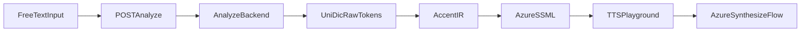

# Azure Analyze API Contract

## Goal

自由入力された日本語テキストを `AccentIR` と Azure 向け `SSML` に変換する
analyze API の request / response / error contract を定義する。

この contract は、`packages/tts-playground` と外部 analyze backend が独立に実装を進められるようにするためのものです。

## Scope

- input は `text` を最優先にする
- output は `accentIR`, `azureSSML`, `warnings` を最小セットにする
- Azure-only slice として十分な shape を定義する
- 将来の `Google` 比較や token debug を壊さないように optional fields を残す

## Endpoint

```txt
POST /analyze
```

## Request

### Shape

```json
{
  "text": "箸を持つ。",
  "locale": "ja-JP",
  "voice": "ja-JP-NanamiNeural",
  "includeDebug": true
}
```

### Fields

- `text`: required string
  自由入力された日本語テキスト
- `locale`: optional string
  既定値は `ja-JP`
- `voice`: optional string
  Azure SSML を生成する際の hint。音声生成そのものは別 request に分かれてもよい
- `includeDebug`: optional boolean
  `rawTokens` や内部 warning を返すかどうか

### TypeScript sketch

```ts
interface AnalyzeRequest {
  text: string
  locale?: string
  voice?: string
  includeDebug?: boolean
}
```

## Success Response

### Shape

```json
{
  "text": "箸を持つ。",
  "locale": "ja-JP",
  "accentIR": {
    "locale": "ja-JP",
    "segments": [
      {
        "type": "text",
        "text": "箸を",
        "reading": "はしを",
        "accent": { "downstep": 1 },
        "hints": {
          "azurePhoneme": {
            "alphabet": "sapi",
            "value": "ハ'シオ"
          }
        }
      },
      {
        "type": "text",
        "text": "持つ",
        "reading": "もつ",
        "accent": { "downstep": 1 },
        "hints": {
          "azurePhoneme": {
            "alphabet": "sapi",
            "value": "モ'ツ"
          }
        }
      },
      {
        "type": "break",
        "strength": "strong"
      }
    ]
  },
  "azureSSML": "<speak version=\"1.0\" xmlns=\"http://www.w3.org/2001/10/synthesis\" xml:lang=\"ja-JP\"><voice name=\"ja-JP-NanamiNeural\"><phoneme alphabet=\"sapi\" ph=\"ハ'シオ\">箸を</phoneme><phoneme alphabet=\"sapi\" ph=\"モ'ツ\">持つ</phoneme><break strength=\"strong\"/></voice></speak>",
  "warnings": [],
  "debug": {
    "rawTokens": [
      {
        "surface": "箸",
        "reading": "ハシ",
        "pronunciation": "ハシ",
        "partOfSpeech": {
          "level1": "名詞",
          "level2": "普通名詞",
          "level3": "一般"
        },
        "accent": {
          "accentType": "1"
        }
      }
    ]
  }
}
```

### Fields

- `text`: original input text
- `locale`: resolved locale
- `accentIR`: required
  backend が組み立てた `AccentIR`
- `azureSSML`: required
  `AccentIR -> Azure SSML` の結果
- `warnings`: required array
  `AccentIR` 組み立て、hint 生成、SSML emitter の warning をまとめて返す
- `debug`: optional object
  `includeDebug` が true のときだけ返す
- `debug.rawTokens`: optional array
  backend が正規化した `UniDicRawToken[]`

### TypeScript sketch

```ts
import type { AccentIR, AccentIREmitWarning, UniDicRawToken } from "@ssml-utilities/accent-ir"

interface AnalyzeSuccessResponse {
  text: string
  locale: string
  accentIR: AccentIR
  azureSSML: string
  warnings: AccentIREmitWarning[]
  debug?: {
    rawTokens?: UniDicRawToken[]
  }
}
```

## Error Response

### Shape

```json
{
  "error": {
    "code": "ANALYZE_BACKEND_UNAVAILABLE",
    "message": "Analyze backend is temporarily unavailable."
  }
}
```

### Suggested error codes

- `BAD_REQUEST`
  invalid or empty input
- `UNIDIC_NOT_CONFIGURED`
  backend 起動時の辞書設定不備
- `MECAB_EXECUTION_FAILED`
  解析プロセス失敗
- `ANALYZE_BACKEND_UNAVAILABLE`
  runtime unavailable
- `INTERNAL_ERROR`
  unexpected failure

### TypeScript sketch

```ts
interface AnalyzeErrorResponse {
  error: {
    code:
      | "BAD_REQUEST"
      | "UNIDIC_NOT_CONFIGURED"
      | "MECAB_EXECUTION_FAILED"
      | "ANALYZE_BACKEND_UNAVAILABLE"
      | "INTERNAL_ERROR"
    message: string
  }
}
```

## Responsibility Boundary

### Frontend / `tts-playground`

- collect free-text input
- call `/analyze`
- show `AccentIR`, `azureSSML`, warning list
- optionally pass generated `azureSSML` into the existing Azure verification flow

### Analyze Backend

- run `MeCab + UniDic`
- normalize to `UniDicRawToken[]`
- convert to `AccentIR`
- derive Azure pronunciation hints
- emit Azure SSML

### Azure Verification Flow

- remains separate from `/analyze`
- can either:
  - accept `azureSSML` from `/analyze` and call Azure directly, or
  - in a later step, analyze backend can offer a combined analyze-and-synthesize API

## Recommended Initial Flow



## Notes

- この contract は Azure-only slice を前提にしている
- `Google` を後で追加するときは `googleSSML?: string` や provider-specific debug を optional field として拡張する
- `warnings` は emitter warning だけでなく、adapter / hint generation の warning も含めてよい
- `rawTokens` は debug 用なので、常時返却しなくてよい
