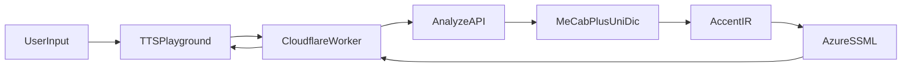

# Azure UniDic Backend Strategy

## Goal

自由入力された日本語を本物の `UniDic` で解析し、`AccentIR -> Azure SSML` へ流すための、
`Cloudflare front + external analysis backend` 構成の前提を整理する。

## Recommendation

- `Cloudflare` 側は `tts-playground` と軽い request forwarding に留める。
- `MeCab + UniDic` は Cloudflare Workers / Pages Functions ではなく、外部の container backend で動かす。
- `UniDic` は backend image へ組み込むか、backend host にマウントして配置する。
- 初期フェーズでは analyze backend は `text -> AccentIR -> Azure SSML` を返し、Azure 音声生成自体は引き続き `tts-playground` / Worker 経由で行う。

## Why Not Workers

- Cloudflare Workers の bundle size は plan に応じて 3 MB / 10 MB 程度で、Worker bundle に巨大辞書を載せる設計には向かない。
- Workers の file system は `/bundle` が read-only、`/tmp` は request ごとの一時領域で永続化されない。
- 話し言葉版 `UniDic` は数百 MB 級の配布物で、request ごとに読み込む設計にも向かない。

## Recommended Architecture

## Component Responsibilities

### `packages/tts-playground`

- 自由入力 UI
- sample / free-text mode の切り替え
- analyze API への request
- Azure SSML の確認
- Azure 音声生成の BYO-credential flow

### Cloudflare Worker

- browser からの Azure 呼び出し中継
- 必要なら analyze backend への軽い proxy
- CORS, response shaping, temporary request routing

### External Analysis Backend

- `MeCab + UniDic` 実行
- `UniDicRawToken[]` 正規化
- `AccentIR` 組み立て
- `AccentIR -> Azure SSML` 生成
- free-text analyze API の response 返却

## UniDic Placement

### Recommended

- backend image 内に固定バージョンの辞書を配置する
- 例: `/opt/dictionaries/unidic-csj/3.1.0`

Pros:

- 起動時ダウンロードが不要
- version pin が明確
- runtime variance が少ない

Cons:

- image size は大きくなる

### Acceptable

- backend host / volume に辞書を置いて mount する
- 例: `UNIDIC_DIR=/mnt/dictionaries/unidic-csj/3.1.0`

Pros:

- image を軽くできる
- 辞書差し替えがしやすい

Cons:

- deploy 環境側の volume 管理が必要

### Not Recommended

- repo に辞書を commit する
- npm package に辞書を含める
- Worker / Pages Functions に辞書を直接載せる
- request ごとに R2 から辞書を取得して展開する

## Runtime Candidates

### Container-first runtimes

- Google Cloud Run
- Fly.io Machines / Apps
- Render Web Service
- self-managed VM / VPS with Docker

These all fit the same model:

- Linux container
- `MeCab` installable
- `UniDic` directory mount or bake-in possible
- plain HTTP API exposed to Cloudflare

### Recommended Initial Shape

- Node.js backend in a container
- `MeCab` installed in image
- `UniDic` spoken dictionary installed in image or mounted volume
- HTTP `POST /analyze` endpoint returning `AccentIR` and Azure SSML

## Operational Assumptions

- `UniDic` is not committed to this repository.
- Dictionary version is pinned explicitly.
- Backend startup fails fast if `UNIDIC_DIR` is missing.
- Backend exposes a simple health endpoint separate from analyze.
- Azure credentials are not required by the analyze backend if Azure synthesis remains BYO-credential in the playground.

## Suggested Environment Variables

- `UNIDIC_DIR`
- `MECAB_DICDIR`
- `ANALYZE_API_BASE_URL`
- `ANALYZE_API_TOKEN` (optional, if frontend access should be restricted)

## Suggested Backend Contract Direction

The next implementation step should define a request / response contract such as:

- request: `text`, optional `locale`, optional `voice`
- response: `accentIR`, `azureSSML`, `warnings`, optional `rawTokens`

This is intentionally aligned with `#154`, which should define the actual API contract.

## References

- Cloudflare Workers limits: https://developers.cloudflare.com/workers/platform/limits/
- Cloudflare Workers `fs`: https://developers.cloudflare.com/workers/runtime-apis/nodejs/fs/
- UniDic official downloads: https://clrd.ninjal.ac.jp/unidic/en/download_all_en.html
- UniDic top page: https://clrd.ninjal.ac.jp/unidic/en/
- Azure Speech REST TTS auth: https://learn.microsoft.com/en-us/azure/ai-services/speech-service/rest-text-to-speech
